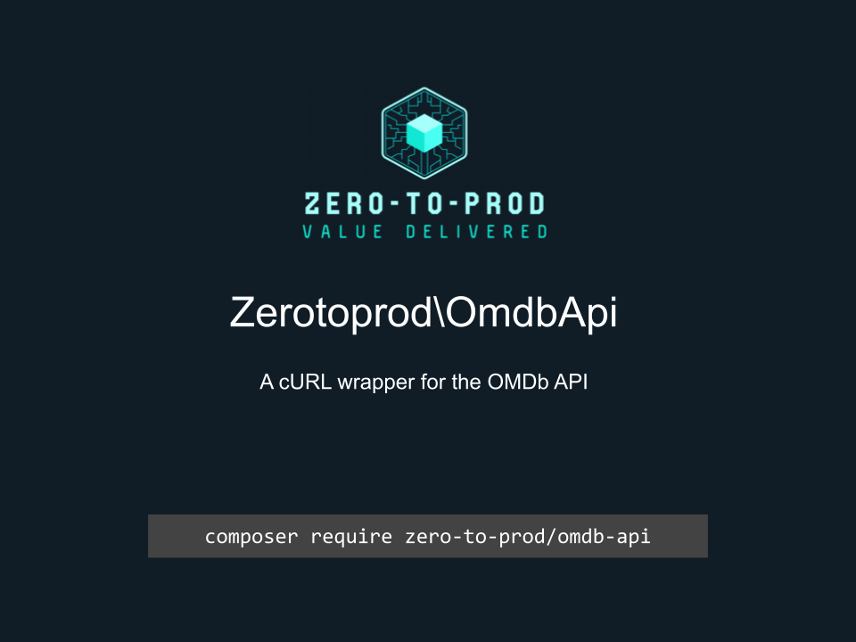

# Zerotoprod\OmdbApi



[](https://github.com/zero-to-prod/omdb-api)
[](https://github.com/zero-to-prod/omdb-api/actions)
[](https://packagist.org/packages/zero-to-prod/omdb-api/stats)
[](https://packagist.org/packages/zero-to-prod/omdb-api)
[](https://github.com/zero-to-prod/omdb-api/blob/main/LICENSE.md)

## Contents

- [Introduction](#introduction)
- [TLDR](#tldr)
- [Requirements](#requirements)
- [Getting an OMDb API Key](#getting-an-omdb-api-key)
- [Installation](#installation)
- [Usage](#usage)
- [Methods Overview](#methods-overview)
    - [byIdOrTitle()](#byidortitle)
    - [search()](#search)
    - [poster()](#poster)
- [Error Handling](#error-handling)
- [Testing](#testing)
- [Contributing](#contributing)

## Introduction
`Zerotoprod\OmdbApi` is a PHP cURL wrapper for the [OMDb API](https://www.omdbapi.com/).
It allows you to search for movies, series, and other media, retrieve detailed information using IMDb IDs or titles, and fetch poster images.

## TLDR

```php
use Zerotoprod\OmdbApi\OmdbApi;

$OmdbApi = new OmdbApi('apiKey');

// Find a title by ImdbID (Internet Movie DataBase ID) or title
$OmdbApi->byIdOrTitle('Avatar')['Title']; // 2009

// Find multiple titles
$OmdbApi->search('Avatar')['Search'][0]['Year']; // 2009

// Get the poster art of a title by its ImdbID
$OmdbApi->poster('tt0499549'); // https://img.omdbapi.com/?apikey=8f8423aa&i=tt0499549
```

## Requirements

- PHP 8.1 or higher.
- cURL extension enabled (typically enabled by default in most PHP installations).
- A valid [OMDb API key](https://www.omdbapi.com/apikey.aspx). A free key is typically available.

## Getting an OMDb API Key

1. Go to the [OMDb API website](https://www.omdbapi.com/apikey.aspx).
2. Sign up for a free or paid plan depending on your usage requirements.
3. After registering, you will receive an API Key that you must pass to the OmdbApi class during initialization.

## Installation

Install `Zerotoprod\OmdbApi` via [Composer](https://getcomposer.org/):

```shell
composer require zero-to-prod/omdb-api
```

This will add the package to your project’s dependencies and create an autoloader entry for it.

## Usage

Initialization

```php
use Zerotoprod\OmdbApi\OmdbApi;

$OmdbApi = new OmdbApi('apiKey');
```

You can also customize the base URL and the poster URL if you need to (for example, to proxy through another service):

```php
$OmdbApi = new OmdbApi(
    apikey: 'your-omdb-api-key',
    base_url: 'https://www.omdbapi.com/',
    img_url: 'https://img.omdbapi.com/'
);
```

## Methods Overview

Below is a summary of the primary methods exposed by this package:

### `byIdOrTitle()`

Retrieve detailed information about a specific movie, TV series, or episode by either its IMDb ID or title.

```php
public function byIdOrTitle(
    ?string $title = null,      // (optional): A string containing the title to look up (e.g. “Avatar”)
    ?string $imdbID = null,     // (optional): A valid IMDb ID (e.g. “tt1285016”)
    ?string $type = null,       // (optional): The type of media to search for. Acceptable values are “movie”, “series”, "game", or “episode”.
    ?int    $year = null,       // (optional): Year of release
    ?bool   $full_plot = false, // (optional): If true, returns the full plot instead of a short summary
    mixed   $callback = null,   // (optional): JSONP callback name (if needed).
    ?string $version = null,    // (optional): Reserved for future use.
    ?array  $CURLOPT = [CURLOPT_TIMEOUT => 10] // An associative array of [cURL options](https://www.php.net/manual/en/function.curl-setopt.php). Defaults to [CURLOPT_TIMEOUT => 10].
): array
```

Returns on Error

```json
{
  "ErrorType": "string",
  "message": "string",
  "extra": "optional, mixed"
}
```

Returns Data

```json
{
  "Title": "Avatar",
  "Year": "2009",
  "Rated": "PG-13",
  "Released": "18 Dec 2009",
  "Runtime": "162 min",
  "Genre": "Action, Adventure, Fantasy",
  "Director": "James Cameron",
  "Writer": "James Cameron",
  "Actors": "Sam Worthington, Zoe Saldana, Sigourney Weaver",
  "Plot": "A paraplegic Marine dispatched to the moon Pandora on a unique mission becomes torn between following his orders and protecting the world he feels is his home.",
  "Language": "English, Spanish",
  "Country": "United States, United Kingdom",
  "Awards": "Won 3 Oscars. 91 wins & 131 nominations total",
  "Poster": "https://m.media-amazon.com/images/M/MV5BMDEzMmQwZjctZWU2My00MWNlLWE0NjItMDJlYTRlNGJiZjcyXkEyXkFqcGc@._V1_SX300.jpg",
  "Ratings": [
    {
      "Source": "Internet Movie Database",
      "Value": "7.9/10"
    },
    {
      "Source": "Rotten Tomatoes",
      "Value": "81%"
    },
    {
      "Source": "Metacritic",
      "Value": "83/100"
    }
  ],
  "Metascore": "83",
  "imdbRating": "7.9",
  "imdbVotes": "1,411,534",
  "imdbID": "tt0499549",
  "Type": "movie",
  "DVD": "N/A",
  "BoxOffice": "$785,221,649",
  "Production": "N/A",
  "Website": "N/A",
  "Response": "True"
}
```

### `search()`

Search for multiple titles using a keyword.

```php
public function search(
    string $title,          // (required): A string representing the search term (e.g. “Avatar”)
    ?string $type = null,   // (optional): “movie”, “series”, or “episode”
    ?int $year = null,      // Year of release to narrow down results
    ?int $page = 1,         // (optional): Page number for paginated results
    mixed $callback = null, // (optional): JSONP callback name
    ?string $version = null,// (optional): Reserved for future use
    ?array $CURLOPT = [CURLOPT_TIMEOUT => 10] // An associative array of [cURL options](https://www.php.net/manual/en/function.curl-setopt.php). Defaults to [CURLOPT_TIMEOUT => 10].
): array
```

Returns on Error

```json
{
  "ErrorType": "string",
  "message": "string",
  "extra": "optional, mixed"
}
```

Returns Data

```json
{
  "Search": [
    {
      "Title": "Avatar",
      "Year": "2009",
      "imdbID": "tt0499549",
      "Type": "movie",
      "Poster": "https://m.media-amazon.com/images/M/MV5BMDEzMmQwZjctZWU2My00MWNlLWE0NjItMDJlYTRlNGJiZjcyXkEyXkFqcGc@._V1_SX300.jpg"
    },
    {
      "Title": "Avatar: The Way of Water",
      "Year": "2022",
      "imdbID": "tt1630029",
      "Type": "movie",
      "Poster": "https://m.media-amazon.com/images/M/MV5BNmQxNjZlZTctMWJiMC00NGMxLWJjNTctNTFiNjA1Njk3ZDQ5XkEyXkFqcGc@._V1_SX300.jpg"
    }
  ],
  "totalResults": "113",
  "Response": "True"
}
```

### `poster()`

Get the direct URL to the poster image for a given IMDb ID.

```php
$OmdbApi->poster('tt0499549'); // https://img.omdbapi.com/?apikey=8f8423aa&i=tt0499549
```

### Error Handling

When a request fails (for example, if no matching title is found, cURL fails to initialize, or an invalid response comes back), the returned array
includes:

```php
[
    'ErrorType' => 'validation' | 'curl' | 'server',
    'message'   => 'A descriptive message about the error.',
    'extra'     => [...optional additional data...]
]
```

## Testing

This package uses [PHPUnit](https://phpunit.de/) for testing.
Run the tests locally:

```shell
./vendor/bin/phpunit
```

Ensure you have installed all the development dependencies (composer install) before running the tests.

## Contributing

Contributions, issues, and feature requests are welcome!
Feel free to check the [issues](https://github.com/zero-to-prod/omdb-api/issues) page if you want to contribute.

1. Fork the repository.
2. Create a new branch (`git checkout -b feature-branch`).
3. Commit changes (`git commit -m 'Add some feature'`).
4. Push to the branch (`git push origin feature-branch`).
5. Create a new Pull Request.